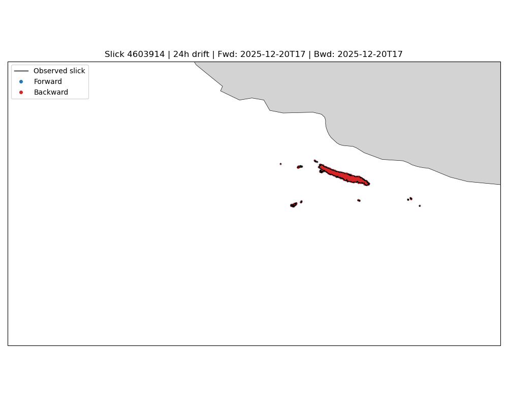
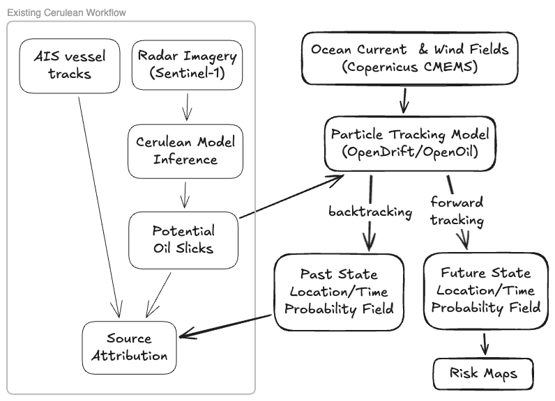
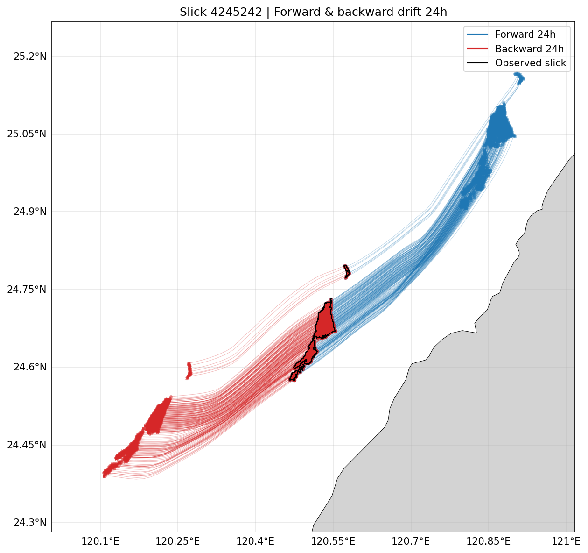

# Cerulean Forward

Coupling [SkyTruth Cerulean](https://cerulean.skytruth.org/) oil slick detections with
the [OpenDrift](https://opendrift.github.io/) particle tracking framework, driven by
hourly [Copernicus Marine (CMEMS)](https://marine.copernicus.eu/) surface currents, to
model where a detected slick is going (forward tracking) and where it came from
(backward tracking).



## Motivation

Cerulean detects oil slicks globally from Sentinel-1 SAR imagery and matches them to
potential sources (vessels via AIS, and fixed infrastructure) using heuristic metrics
of parity, proximity, and temporality. Those heuristics work well for linear slicks
produced under uniform current and wind conditions. Many slicks are not linear:
variable currents and winds fold and stretch them, as illustrated in the
[Cerulean guide](https://skytruth.org/cerulean/guide-slick-details).

A physics-based transport model can complement the heuristics:

- **Backward in time** — seed particles inside the observed slick polygon and run the
  model in reverse to produce a spatial/temporal probability field for the source
  location, narrowing the set of candidate vessels or infrastructure.
- **Forward in time** — run the same model forward to forecast the slick's near-term
  evolution, which is useful to spill responders and to anyone validating the model
  against the next Sentinel-1 pass.



The building blocks already exist and are open:

- **Ocean currents** — the CMEMS Global Ocean Physics Analysis and Forecast service
  (`cmems_mod_glo_phy_anfc_merged-uv_PT1H-i`) provides hourly surface currents,
  tides, and Stokes drift, as both forecasts and reanalyses.
- **Particle tracking** — OpenDrift, developed by [MET Norway](https://www.met.no/en),
  is open source, actively maintained, in operational use, and ships a
  [CMEMS reader](https://opendrift.github.io/autoapi/opendrift/readers/reader_copernicusmarine/index.html)
  and an oil-physics module, [OpenOil](https://opendrift.github.io/autoapi/opendrift/models/openoil/openoil/index.html).

## What's here

| Path | Contents |
| --- | --- |
| [`opendrift.ipynb`](opendrift.ipynb) | The experiment: load a Cerulean slick polygon, open the CMEMS dataset lazily, build OpenDrift readers for the total / tidal / Stokes current components, seed particles inside the slick, run 24 h forward and backward, and plot trajectories and an animation. |
| [`data/`](data/) | Slick geometries for four Cerulean detections, exported as GeoJSON. |
| [`outputs/`](outputs/) | Trajectory plots and animations produced by the notebook for each slick. |
| [`presentation.qmd`](presentation.qmd) | A [Quarto reveal.js](https://quarto.org/docs/presentations/revealjs/) deck walking through the idea and the results. |
| [`images/`](images/) | Figures used by the README and deck, including the Excalidraw source for the data flow diagram. |

## Example slicks

| Slick | Region | Observed | Trajectories | Animation |
| --- | --- | --- | --- | --- |
| [4603914](https://cerulean.skytruth.org/slicks/4603914) | North Sea, near land | 2025-12-20 | [png](outputs/drift_trajectories-4603914.png) | [gif](outputs/drift_combined-4603914.gif) |
| [4247543](https://cerulean.skytruth.org/slicks/4247543) | North Sea, cross-shaped | 2025-07-21 | [png](outputs/drift_trajectories-4247543.png) | [gif](outputs/drift_combined-4247543.gif) |
| [4245242](https://cerulean.skytruth.org/slicks/4245242) | Near Taiwan, two AIS matches | 2025-07-20 | [png](outputs/drift_trajectories-4245242.png) | [gif](outputs/drift_combined-4245242.gif) |
| [4167052](https://cerulean.skytruth.org/slicks/4167052) | Near Indonesia | 2025-06-13 | [png](outputs/drift_trajectories-4167052.png) | [gif](outputs/drift_combined-4167052.gif) |

Some things visible in the results:

- For 4603914 the backward run bunches up along the matched AIS track, while part of
  the forward run washes ashore.
- 4247543 stays elongated when run backward, suggesting a prolonged release rather
  than a point discharge.
- Cerulean matched 4245242 to two vessels; the backward run lines up better with the
  one moving toward shore.



## Running it

Dependencies are managed with [pixi](https://pixi.sh/); the lockfile is committed.

```sh
pixi install
```

The notebook reads CMEMS data through the
[Copernicus Marine Toolbox](https://toolbox-docs.marine.copernicus.eu/), which needs a
free Copernicus Marine account. Log in once and the credentials are cached outside
the repo:

```sh
pixi run copernicusmarine login
```

Then either open the notebook interactively or execute it in place:

```sh
pixi run lab        # jupyter lab opendrift.ipynb
pixi run notebook   # execute opendrift.ipynb headless, writing to outputs/
```

Pick a slick by uncommenting its `slick_id` / `observation_timestamp` block in the
second cell. The CMEMS dataset is opened lazily (it is ~13 TB in total); OpenDrift
requests only the slices it needs as the simulation advances.

To render the slides:

```sh
pixi run slides     # quarto render presentation.qmd -> presentation.html
```

## Next steps

Things this demo does not do yet:

- Use OpenOil instead of OceanDrift so weathering, evaporation, and entrainment are
  modeled, and add wind forcing.
- Aggregate particle positions into gridded probability fields at each time step
  instead of plotting raw trajectories.
- Score candidate sources (AIS tracks, infrastructure) against the backward
  probability field.
- Validate forward predictions against the next Sentinel-1 detection of the same slick.

## Acknowledgements and data

- Slick geometries in `data/` are from [SkyTruth Cerulean](https://cerulean.skytruth.org/).
- Ocean current data: E.U. Copernicus Marine Service Information (CMEMS), Global
  Ocean Physics Analysis and Forecast, hourly merged surface currents.
- Particle tracking: [OpenDrift](https://github.com/OpenDrift/opendrift) by MET Norway.
  The OpenDrift [gallery](https://opendrift.github.io/gallery/index.html) has many more
  examples of what the framework can do.
- Photos in the deck: U.S. Navy (released) and NASA (public domain).

## License

[MIT](LICENSE).
