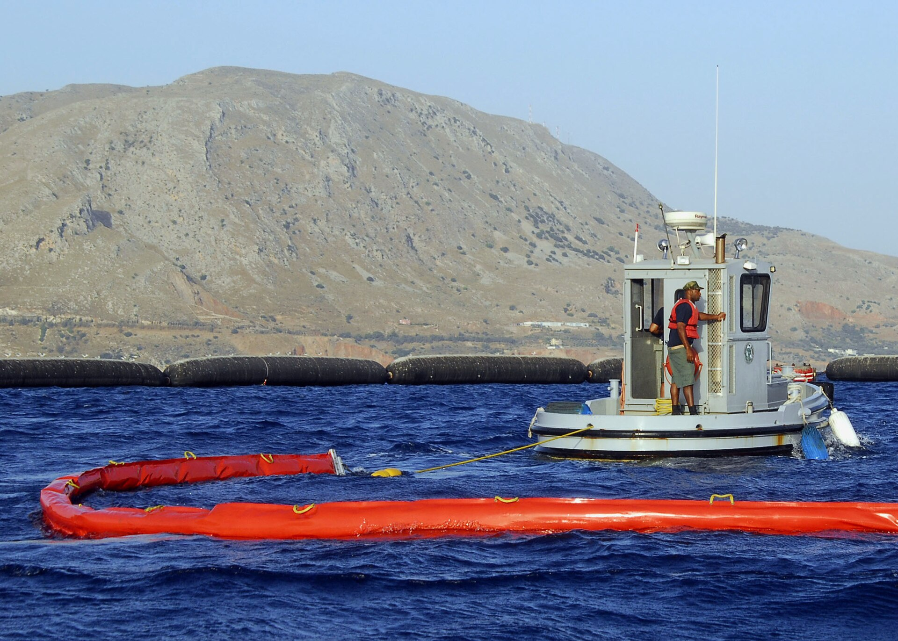
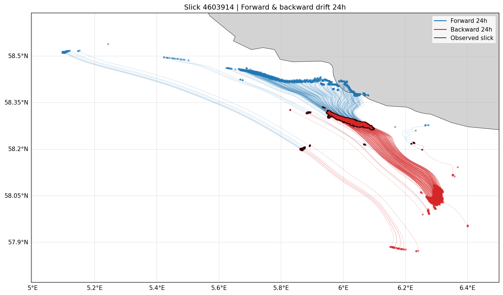
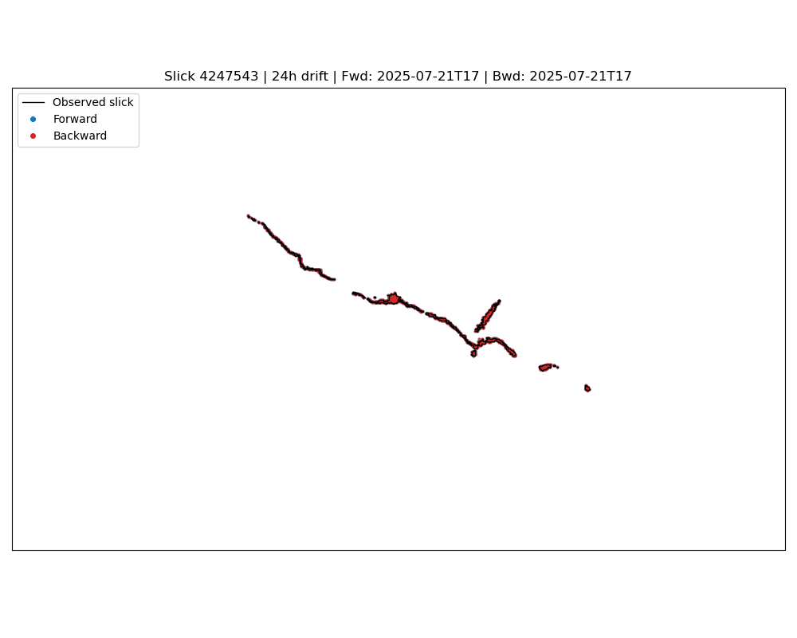
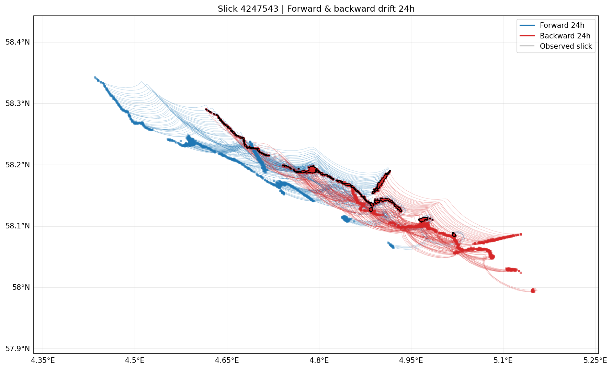
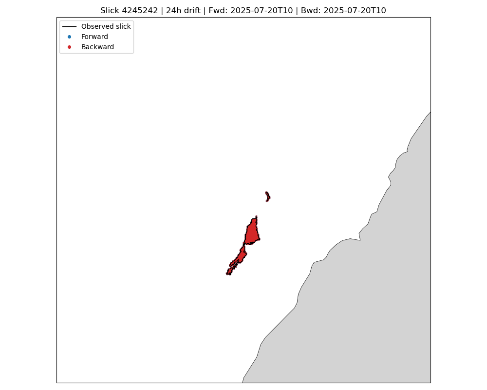
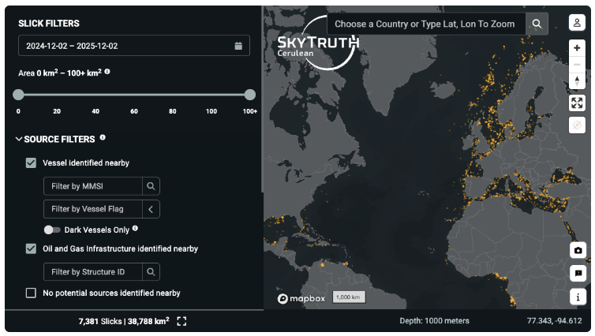

# The Opportunity {style="& p { margin: 0.3em 0; }"}

SkyTruth's Cerulean system detects oil slicks globally using Sentinel-1 SAR imagery and matches them to potential sources.

{width=60%}

Currently matching is based on heuristic metrics of **parity, proximity, & temporality** — effective for linear slicks under uniform conditions. But many slicks have complex geometries due to variable current and wind transport.

{height=220}

::: {.notes}
- The Cerulean system uses simple heuristics
- Many slicks don't exhibit linear shapes
- **Opportunity** for better results using a more rigorous modeling approach
:::

# The Idea

:::: {.columns}

::: {.column width="55%"}
**Couple Cerulean oil slick detections with a particle tracking model to generate spatial/temporal probability fields both forward and backward in time.**

- Forecast near-term slick evolution *(forward tracking)*
- Improve source attribution *(backward tracking)*
:::

::: {.column width="45%"}

:::

::::

::: {.notes}
- Couple oil slick detections with a physics-based, data-driven particle tracking model
- Allows for **forecasting** the future
- **and** improving source attribution
:::

# Who Could This Help?

:::: {.columns}

::: {.column width="55%"}
 

**New user groups** that would utilize forecasted oil slick movement / fate

- **Oil Spill Response Orgs**
- **Environmental Litigators**
- **Academic Researchers**

 
**Existing user groups** that would benefit from improved source attribution

- **Enforcement Orgs**
- **Investigative Journalists**
- **Policy Advocacy Orgs**
:::

::: {.column width="45%"}

:::

::::

::: {.notes}
- New users!
- Strengthen existing use cases!
- Images: U.S. Navy (released), NASA (public domain)
:::

# System Architecture

{fig-align="center" width=100%}

::: {.notes}
- Existing system on the left
- Feed a particle tracking model with current and wind fields
- Run the model forward and backward in time
- Output probability fields at each time step
- Particles would be aggregated into probability fields
:::

# Why now?

 

- **Cerulean Oil Slick Detection** 
  - late 2024 - Version 1 released
- **OpenDrift / OpenOil**
  - particle tracking framework / oil physics module is in operational use
- **High-resolution Ocean Data**
  - 2019 - Copernicus Marine Service (CMEMS) SMOC (Surface Merged Ocean Current)
  - 2025-2026 - Recent advances in Earth system modeling with ML/deep learning and cloud optimized data repositories

# How feasible is this?

A few experiments with [OpenDrift](https://opendrift.github.io/) driven by hourly CMEMS surface currents,
seeded from Cerulean slick geometries and run 24 h forward and backward.

See [`opendrift.ipynb`](https://github.com/tylere/cerulean-forward/blob/main/opendrift.ipynb).

## Slick 4603914 (North Sea)

:::: {.columns}

::: {.column width="40%"}
<iframe src="https://cerulean.skytruth.org/slicks/4603914" width="100%" height="600" style="border: 1px solid #ccc; border-radius: 4px;"></iframe>
:::

::: {.column width="60%"}
::::: {.fragment}

:::::
:::

::::

::: {.notes}
- [ZOOM OUT to SHOW WHERE]
- FORWARD (blue) Part of the slick washes ashore
- BACKWARD (red) It seems to match up well with the AIS track. And bunches up.
- Some of the geometries don't seem to be connected... maybe they could be removed?
:::

## Slick 4603914 (North Sea)

{fig-align="center" width=100%}

## Slick 4247543 (North Sea)

:::: {.columns}

::: {.column width="40%"}
<iframe src="https://cerulean.skytruth.org/slicks/4247543" width="100%" height="600" style="border: 1px solid #ccc; border-radius: 4px;"></iframe>
:::

::: {.column width="60%"}

:::

::::

::: {.notes}
- More complex slick shape.
- On a different day, and you can see the effects of shifting currents and winds.
- Unlike the previous slick, this one stays elongated when moving backward in time. Prolonged release? Started >24 hours ago?
:::

## Slick 4247543 (North Sea)

{fig-align="center" width=100%}

## Slick 4245242 (Near Taiwan)

:::: {.columns}

::: {.column width="35%"}
<iframe src="https://cerulean.skytruth.org/slicks/4245242" width="100%" height="600" style="border: 1px solid #ccc; border-radius: 4px;"></iframe>
:::

::: {.column width="65%"}

:::

::::

::: {.notes}
- Oil slick near Taiwan
    - *[Zoom out in the IFrame]*
- Transport is more uniform, although you can still see the geometry changing.
- **Cerulean matched this slick with two vessels.**
- Which vessel is more likely?
  - Red matches up well with the ship moving closer to shore.
:::

## Slick 4245242 (Near Taiwan)

{fig-align="center" width=100%}

::: {.notes}
- Transport is pretty uniform in time, but you can see the geometry changing.
:::

# Risks & Mitigations

| Risk | Impact | Mitigation |
| --- | --- | --- |
| Insufficient "ground truth" /  benchmark data | Cannot validate model performance | Use subsequent Cerulean observations to validate model performance |
| Insufficient input data resolution/accuracy | Local transport not captured | Evaluate regional models; tune diffusion |
| System latency | Not feasible for decision-making | AIS delay dominates; model runs are minutes per slick |
| Model complexity / flexibility | Easy to criticize model performance | Tune based on rigorous benchmark data |
| External dependency on particle tracking model | Model dependency | Focus on open source models; research switching costs |
| External dependency on data service | Data dependency | Research alternative data sources & switching costs |

# Questions?

+

